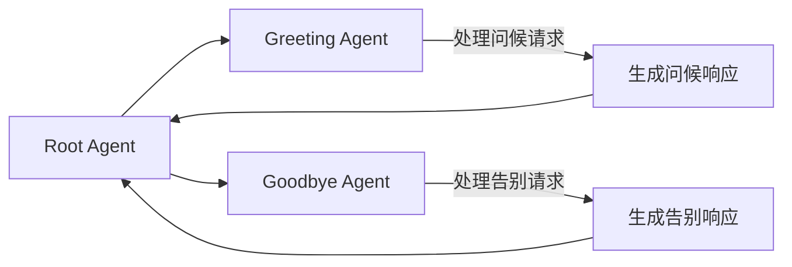

# 简易 Agent 构建

本文档将阐述如何以最简方式构建并运行一个智能体（Agent）。内容涵盖两种主要定义方法：

- 代码定义
- 基于 Agent Builder 的 YAML 定义
  
并介绍两种启动和交互方法：

- **调试环境**：通过 `veadk web` 启动 Web 交互界面
- **生产环境**：在代码环境中使用 Runner 启动智能体

本文档不依赖任何外部复杂组件，旨在帮助您建立最小可运行样例的整体认知。

## Agent 的定义方法

智能体的定义是其生命周期的起点。无论在何种规模的系统中，智能体都是任务拆解、规划的主体。本节介绍两种定义方式：**代码方式**与 **YAML 配置方式**。

### 通过代码构建（Programming）

在代码中直接定义智能体是最常见且最灵活的方式。此方法便于动态调整参数、集成外部模块并进行单元测试。您可以创建一个最简单的 Agent，无需额外设置。所有 Agent 属性均来自环境变量或默认值。例如：

```python
import asyncio
from veadk import Agent, Runner

root_agent = Agent() # 从环境变量读取关键配置

runner = Runner(agent=root_agent)

response = asyncio.run(runner.run("hello"))
print(response)
```

您也可以通过以下方式设置 Agent 的元数据信息：

```python
from veadk import Agent, Runner

root_agent = Agent(
    name="meeting_assistant",
    description="一个帮助用户安排会议的助手。",
    # 系统提示
    instruction="首先了解用户的会议时间、地点及其他关键信息，然后给出会议计划。",
)
```

如果您想使用本地模型或其他提供商的模型，可以在初始化时指定模型相关配置：

```python
from veadk import Agent

agent = Agent(
    model_provider="...",
    model_name="...",
    model_api_key="...",
    model_api_base="..."
)
```

您可以查看 [LiteLLM 支持的模型提供商列表](https://)。

此外，您还可以根据[火山引擎方舟大模型平台](https://)的能力，指定一些[额外选项](https://)，例如：

```python
# 禁用思考
model_extra_config = {}
```

在某些系统中，多 Agent 设计是必要的，您可以通过 `sub_agent` 参数实现下图所示的多代理系统：



```python
from veadk import Agent

greeting_agent = Agent()
goodbye_agent = Agent()

root_agent = Agent(sub_agent=[greeting_agent, goodbye_agent])
```

### 通过 YAML 配置文件（Declarative）

在您构建 Agent 过程中，往往需要更加简洁的 Agent 定义方式与配置管理。为了方便这种场景，VeADK 提供了 YAML 文件定义方式。该方法以声明式语法描述智能体的全部元信息与行为结构。

**基本结构**：

```yaml [agent.yaml]
root_agent:
  type: Agent # Agent | SequencialAgent | LoopAgent | ParallelAgent
  name: intelligent_assistant
  description: An intelligent_assistant.
  instruction: Help user according to your sub agents.
  model_name: ...
  sub_agents:
    - ${sub_agent_1}

sub_agent_1:
  type: Agent
  name: weather_reporter
  tools:
    - name: veadk.tools.demo_tools.get_city_weather # tool 所在的模块及函数名称
```

**结构说明**：

- `type`: 智能体类别
- `name`: 智能体名称
- `description`: 智能体的总体描述
- `instruction`：智能体的系统提示词（System prompt）
- `model_name`: 模型名称
- `tools`: 工具列表与调用规则
- `sub_agents`: 子智能体引用

**使用方法**：

```python [agent.py]
import asyncio

from veadk import Runner
from veadk.agent_builder import AgentBuilder

agent_builder = AgentBuilder()

agent = agent_builder.build(path="agent.yaml")

runner = Runner(agent)
response = asyncio.run(runner.run("北京天气"))

print(response)
```

### 定义方法对比

**对比总结**：

| 特性   | 代码方式  | YAML 方式 |
| ---- | ----- | ------- |
| 灵活性  | 高     | 中       |
| 可读性  | 中     | 高       |
| 可维护性 | 中     | 高       |
| 动态生成 | 支持    | 一般      |
| 适用场景 | 开发、生产 | 实验、配置化、生产  |

## 构建一个混合定义的智能体应用

以下示例展示从零开始构建并运行一个基础 Agent 的流程。启动后，该 Agent 能在命令行终端中与您进行多轮对话。

### 应用结构

我们将通过构建 2 个智能体，来实现一个营销策划文案生成 Agent。其中：

- 主 Agent（`root_agent`）：通过代码定义，接收用户消息，当收到广告营销策划需求时，转交 `idea_agent` 来生成营销创意文案
- 创意文案生成 Agent（`idea_agent`）：通过 YAML 文件定义，能够生成营销策划文案

首先，我们来构建 `idea_agent` 的 YAML 定义文件：

```yaml [idea_agent.yaml]
# 占位: 定义 Agent 的伪代码
```

之后，我们来构建主 Agent，并将两个 Agent 组合：

```python [agent.py]

```

最后，我们加入运行代码，可以通过循环来持续接收用户输入，并观察 Agent 行为：

```python [main.py]
# runner ...
# while True
```

使用 Python 运行 `main.py`：

```bash
python main.py
```

您可以输入提示词“我现在要组织一个关于科技扶贫的公益宣讲活动，请给我生成500字左右的营销策划文案”，并观察到如下输出：

【图片占位】

可以看到，日志中打印出了 `transfer_to_agent` 工具，证明主 Agent 已将任务转移给了创意文案生成 Agent。创意文案生成 Agent 将会输出最终结果：

【图片占位】

## 运行您的 Agent

### 启动 VeADK Web 交互界面

`veadk` 提供内置 Web 运行环境，可快速启动交互界面以测试智能体行为。该方式适合调试、演示等场景。

**启动方式示例**：

```bash
veadk web
```

启动后，可在浏览器访问本地端口（如 `http://localhost:8000`）进入交互界面，直接与 Agent 对话。

**典型功能**：

- 支持多轮会话与上下文追踪；
- 自动展示工具调用结果与响应链路；
- 提供基础日志与监控输出。

### Agent 执行引擎

在实际生产环境下，您需要直接在代码环境中运行 Agent 来提供服务。此时可使用 VeADK 中的执行引擎 `Runner` 来执行 Agent，它负责封装启动流程与状态管理。

**基本调用方式**：

```python
# 占位: Runner 运行 Agent 的示例
```

更多 Runner 的使用方法，详见[这里]()。

**Runner 的主要职责**：

- 初始化 Agent 环境（加载模型、注册工具、准备记忆单元）；
- 维持会话状态并处理多轮输入；
- 输出结构化响应对象，便于程序化分析。
