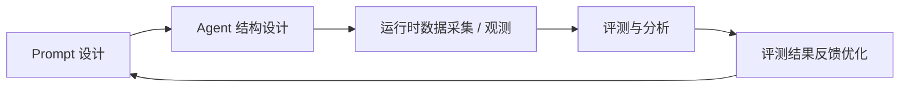

## 实现 Agent 应用的数据飞轮

在构建智能 Agent 应用的过程中，应形成一个持续优化的“数据飞轮”机制。这个飞轮从 Prompt 设计 开始，定义 Agent 的初始行为与意图；接着进行 Agent 结构设计，将功能模块化并实现可扩展的任务执行逻辑；在运行阶段，通过 数据观测与采集 收集 Agent 的输入输出与中间过程数据；随后进行 评测与分析，利用指标体系量化模型表现和用户体验；最后将 评测结果 反馈到 Prompt 和 Agent 设计中，持续优化整体系统。通过这样的闭环过程，Agent 能够不断迭代提升性能与智能水平，形成正向循环的数据驱动优化机制。

## 设计阶段

### Prompt 设计

### Agent 设计

## 数据收集阶段

### 评测

### 筛选

## 评测阶段

### 评估

## 反馈优化阶段

### Prompt 优化

### Agent 结构优化
